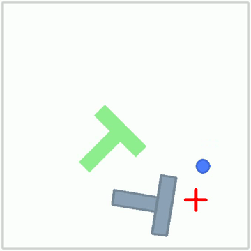

# pusht_ros_bridge

Run a pretrained [LeRobot](https://github.com/huggingface/lerobot) diffusion policy as a **ROS 2 node pair** — observations flow in over topics, actions flow out over topics, GPU inference happens in between. A minimal working take on the first step of the [ROS 2 integration RFC (huggingface/lerobot#4368)](https://github.com/huggingface/lerobot/issues/4368): policy-as-a-node, validated end-to-end.



**Status: experimental — PushT simulation only, not wired to any real robot.**

Tested with: ROS 2 Jazzy · Python 3.12 · lerobot 0.6.1 · torch 2.11 + CUDA 12.x on an RTX 4060 Laptop GPU · Ubuntu 24.04 (WSL2) · RMW CycloneDDS.

## Architecture

```
┌──────────────────────┐                  ┌───────────────────────────┐
│       env_node       │   /pusht/        │        policy_node        │
│                      │   observation    │                           │
│   gym PushT-v0   ────┼─────────────────►│  jpeg/png decode          │
│   96x96 rgb +        │  (custom msg,    │  LeRobot preprocessing    │
│   agent pos          │   atomic)        │  diffusion policy (GPU)   │
│                      │                  │  postprocessing           │
│   episode loop  <────┼──────────────────┤                           │
│                      │   /pusht/action  │                           │
└──────────────────────┘   (2 floats)     └───────────────────────────┘
```

Design points:

- **`pusht_ros_bridge/PushtObservation`** — one message = one complete observation (`CompressedImage` + `float32[2]` agent position). Image and state arrive atomically; no cross-publisher ordering hazards, no "wait until both halves are here" bookkeeping.
- **Observation heartbeat handshake** — until the policy node answers, the env re-publishes the first observation every 2 s (up to 180 s), so an episode starts whenever the slow-loading 1 GB policy is ready. No startup race.
- **FIFO action mailbox** (bounded, drops oldest) — matches the diffusion policy's own action-queue semantics.
- Two independent processes; the only coupling is the two topics.

## Benchmark (10 episodes each, identical seeds 1000–1009)

Metric definitions — PushT **success**: T-block coverage ≥ 0.95 **held to the end** of a max-300-step episode (so a "failed" episode can still reach max coverage 0.99+ without holding it); **sum_reward**: cumulative per-step coverage, roughly 0–250 per episode. Seeds are matched across runs: the bridge loops seeds explicitly, and the lerobot CLI increments its seed per episode from `--seed` (verified in `lerobot_eval` source).

| Metric | Bridge, jpeg q90 | Bridge, PNG lossless | lerobot CLI (in-process) |
|---|---|---|---|
| Success rate | 4/10 (40%) | **7/10 (70%)** | 7/10 (70%) |
| Mean sum reward | 119.6 | 110.5 | 109.1 |
| Sum reward range | 28.4 – 250.2 | 28.9 – 240.9 | 27.2 – 253.8 |
| Mean per-step round-trip | 0.209 s† | 0.269 s | n/a (in-process) |
| Mean episode wall time | ~65 s† | 78.7 s | ~11 s* |

\* CLI time excludes process startup; the bridge numbers include per-episode process cold start (~12 s model load).
† jpeg round-trip measured on a single instrumented episode (latency instrumentation landed after the jpeg benchmark); jpeg wall time estimated from it as `steps × 0.21 s + 12 s`.

Reading the numbers:

- **The bridge itself costs nothing**: PNG (lossless) transport matches the CLI success rate exactly, 7/10, on identical seeds — topic hop + message serialization do not degrade the policy.
- **The jpeg q90 gap (40% vs 70%) is compression, not transport**: it is not statistically significant at n=10 (Fisher exact p ≈ 0.37), but the seed-level pattern is telling — e.g. seed 1001 scores max coverage 0.38 over jpeg and succeeds over PNG.
- Per-episode raw JSON for all 30 episodes (plus the VQ-BeT run): [`benchmarks/`](benchmarks/). Aggregated latency over the 10 PNG episodes: mean 269 ms/step (median 260 ms), mean wall 78.7 s; jpeg episode timings above are the single-episode instrumented estimate.

## Policy-agnostic check (VQ-BeT)

To verify the bridge is not tuned to one policy, it was also run with `lerobot/vqbet_pusht` (VQ-BeT — a codebook-based behavioral transformer, architecturally unrelated to diffusion), migrated with `lerobot.processor.migrate_policy_normalization` and passed via the `model_path` ROS parameter. On seed 1000 the bridge and a direct in-process loop score **identically** (sum 4.85, max coverage 0.0162), matching the diffusion result that the bridge is bit-exact relative to direct inference. The low absolute score is the checkpoint's own behavior under the current lerobot pipeline, not a transport effect (migrated weights were verified bit-identical to the original snapshot, minus the 6 extracted normalization buffers). Practical notes: the 151 MB VQ-BeT checkpoint loads in ~3 s and steps at ~13 ms round-trip (vs 269 ms for diffusion's 1 GB UNet on the same machine).

```bash
MODEL=/root/vqbet_pusht_migrated bash scripts/09-bridge-run.sh 1000
```

## Nodes & parameters

| Node | Topic | Type | Dir |
|---|---|---|---|
| env_node | `/pusht/observation` | `pusht_ros_bridge/PushtObservation` | pub |
| env_node | `/pusht/action` | `std_msgs/Float32MultiArray` | sub |
| policy_node | `/pusht/observation` | `pusht_ros_bridge/PushtObservation` | sub |
| policy_node | `/pusht/action` | `std_msgs/Float32MultiArray` | pub |

QoS: default (reliable, volatile, depth 5) on both sides.

env_node parameters: `seed` (int), `video_path` (mp4 out), `stats_path` (JSON out), `image_codec` (`jpeg`|`png`).
policy_node parameters: `model_path` (checkpoint dir).

Adapting to another policy/env: point `model_path` at a 0.6-format checkpoint, and edit the observation preprocessing in `policy_node._infer_and_publish` to match your env's obs keys. Swap `gym.make` in env_node for your environment (or a real robot driver).

## Running

The companion scripts in [`scripts/`](scripts/) hardcode the workspace layout they were developed on (`/root/ros2_ws`, `/root/lerobot-venv`, WSL2) — adjust the variables at the top when porting.

```bash
# 0. one-time: prepare the migrated checkpoint (see Gotchas #2)
bash scripts/00-prepare-model.sh            # MODEL_REPO=lerobot/diffusion_pusht

# 1. one-time: build the message package (inside WSL)
bash scripts/08-bridge-build.sh

# 2. one episode (env + policy cold start, ~1-2 min on GPU)
bash scripts/09-bridge-run.sh 7             # seed

# 3. benchmarks (10 episodes each)
bash scripts/10-bridge-bench.sh             # bridge, jpeg
bash scripts/12-png-bench.sh                # bridge, png
bash scripts/11-cli-bench.sh                # lerobot CLI baseline
```

Why not `ros2 run`: it always launches nodes with the **system** Python, and the policy node needs `rclpy` + `lerobot` in the same (venv) interpreter. The run scripts execute both nodes with the venv Python directly, with ROS site-packages injected:

```bash
export PYTHONPATH=/opt/ros/jazzy/lib/python3.12/site-packages:$PYTHONPATH
export LD_LIBRARY_PATH=/opt/ros/jazzy/lib:$LD_LIBRARY_PATH
```

## Gotchas baked into the code (lerobot 0.6.1)

1. `PreTrainedConfig.from_pretrained()` does **not** backfill `cfg.pretrained_path` — without the manual backfill, the processor pipeline silently builds with empty normalization stats and the policy acts blind with no error ([#4647](https://github.com/huggingface/lerobot/issues/4647), fix PR [#4648](https://github.com/huggingface/lerobot/pull/4648)).
2. Old checkpoints must be migrated to the 0.6 processor format, and the migration tool's output directory is incomplete ([#4649](https://github.com/huggingface/lerobot/issues/4649)) — `scripts/00-prepare-model.sh` assembles the final directory.
3. `cv2.imencode` expects BGR; gym observations are RGB. Flip before encoding or the policy sees channel-swapped images.
4. Call `policy.reset()` at episode start — the diffusion policy keeps observation/action queues across episodes otherwise.

## Limitations

- jpeg transport measurably hurts final-alignment precision (see benchmark); use `image_codec:=png` unless bandwidth demands jpeg.
- Synchronous request-reply semantics implemented on pub/sub; an action/service-based design would be more idiomatic for tight control loops, this follows the RFC's topic-first direction.
- Single env, single policy, n=10 statistics.

## License

Apache-2.0 (see [LICENSE](LICENSE)). Codebase comments are in English; companion workspace scripts contain some Chinese comments.
